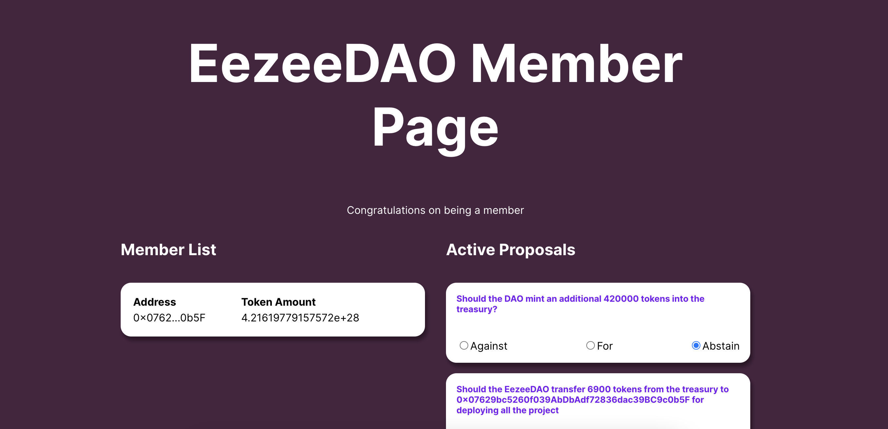

# EezeeDAO

# buildspace x thirdweb - Build your own DAO with just Javascript

### **Welcome 👋**

The .env.example contains the Eezee DAO addresses. To get frontend running with this project, follow these commands:

1. Run `npm install` at the root of your directory
2. Run `npm start` to start the project
3. Start coding!

### **Deploy your own dao?**

Follow the scripts steps running with node and update the .env file with new addresses

